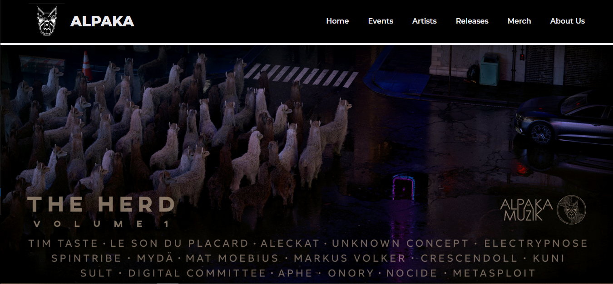
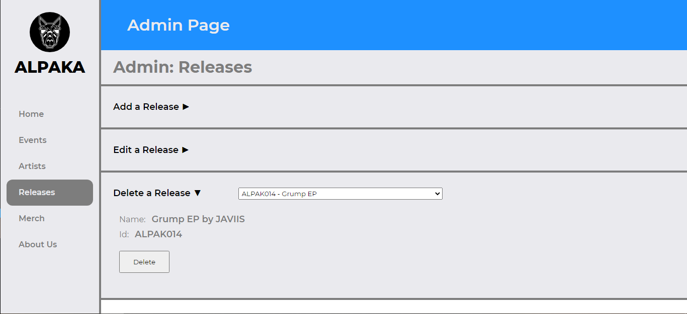
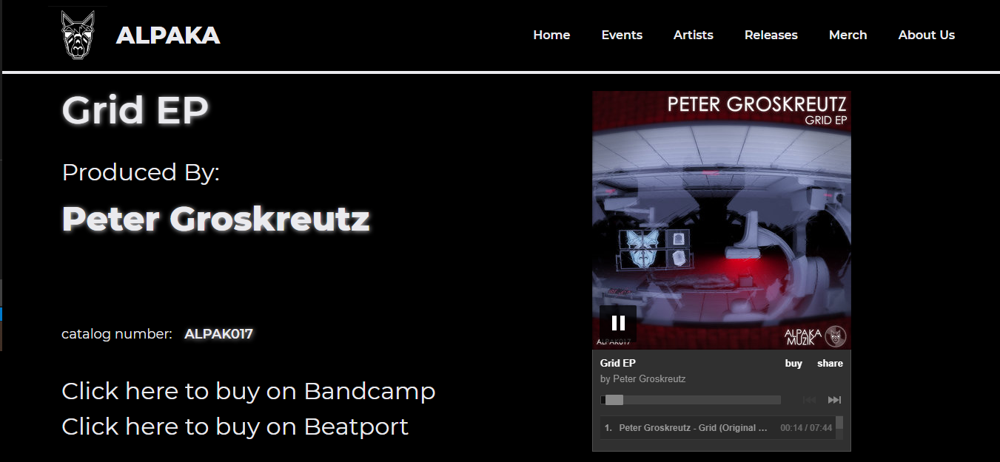

# Bootcamp - FinalProject: Alpaka

## Description

First draft for music label **Alpaka MuziK**'s website. Visit artist page to visit label artists' soundcloud pages. Releases page visit content presentation with an integrated music player to listen to the label releases.

Admin page. Administrator self-sufficiency for updating content.&nbsp;
&nbsp;
&nbsp;

## Stack

- MongoDB
- Express
- React.js
- Node.js

## Requirements

> Create a web application using both front and back-end technologies, including a database.

## Features

- Presentational content for Alpaka
- Functional administrator page
- Listen to releases
- Visit label artists' soundcloud pages
- Add/edit/delete content

[Click here for a quick YouTube demo](https://youtu.be/XR7Lpe3EkbI)

